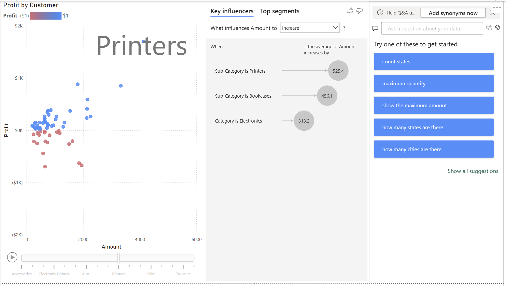

# 📊 E-Commerce Data Power BI Dashboard

## 🧾 Project Description 项目描述

This project is a **Power BI dashboard** based on the [Kaggle E-Commerce Dataset](https://www.kaggle.com/) aimed at uncovering key insights regarding sales, profitability, product performance, and customer segmentation.

该项目基于 Kaggle 上的 **电商数据集**，使用 Power BI 构建交互式仪表板，帮助分析销售情况、盈利能力、产品表现和客户分布等关键指标。

---

## 🎯 Data Story Objectives 数据故事目标

### 🔹 Objective 目标

- Review current product lines and identify areas for improvement  
- 审视现有产品线，识别可改进的地方

### 🔹 Users 用户角色

- **Head of Finance / 财务负责人**

### 🔹 Actions 用户操作

- Identify areas that can improve revenue  
- 识别可以提升收入的领域  
- Identify low-performing products and regions  
- 识别表现不佳的产品和地区

### 🔹 Usage Frequency 使用频率

- **Monthly / 每月一次**

---

## 📌 Key Performance Indicators (KPIs) 核心指标

| KPI 名称 | 目标 | 计算方式 | 数据来源 | 可视化方式 |
|----------|------|----------|----------|-------------|
| Profit 盈利 | 业务的财务驱动因素 | 利润总额 | Order Details.csv | 趋势图、组成图、KPI 卡 |
| Quantity 数量 | 衡量业务各区域的出货量 | 销售总单位数 | Order Details.csv | 多行卡片 |
| Order Volume 订单量 | 仓库的订单发货体量 | Distinct Count of Order ID | List of Orders.csv | KPI、折线图等 |

---

## 🛠️ Project Structure 项目结构

1. **Data Story Definition 数据故事定义**
2. **Load and Transform Data 数据加载与转换**
   - 格式调整、数据合并、处理空行与重复项
3. **Visualizing the Dataset 可视化设计**
   - Z 字形布局 KPI 图表
   - 多行卡片
   - 利润趋势图
   - 各品类利润图（矩阵）
   - 客户盈利能力（散点图）
   - 各州利润图（树状图）
4. **Additional Insights 深入洞察**
   - 利润洞察页面
   - 带时间轴的交互式图表
   - Key Influencers 图表
   - Q&A 图表
5. **Final Touches 最后美化**
   - 添加切片器与交互筛选器

---

## 🔍 Insights 洞察总结

- 总体盈利能力直到 2019 年 10 月前一直为负。
- **Electronic Games** 和 **Tables** 两个品类盈利能力为负，应重点关注。
- 332 位客户中有 **182 位客户盈利为负**，占比约为 **55%**。
- 不盈利客户集中于：**Madhya Pradesh**、**Maharashtra**
- **Bookcases** 和 **Printers** 是推动收入的关键产品子类。

---

## 💡 Recommendations 建议

- 请门店经理评估最不盈利的客户。
- 分析表现不佳的州，找出客户盈利能力差异大的原因。
- 暂停销售 Tables 和 Electronic Games，直到成本结构得到优化。
- 扩大盈利子类的销售，以维持持续的盈利趋势。

---

## 📁 Project Files 项目文件

- `Ecommerce_Dashboard.pbix`: Power BI 项目文件  
- `Order Details.csv`, `List of Orders.csv`: 原始数据文件  
- `Dashboard_Screenshots/`: 仪表板截图  

---

## 📸 Dashboard Screenshots 仪表板截图

  

