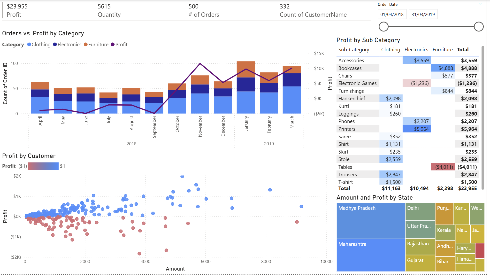

# E-Commerce Data Power BI Dashboard

## Project Description

This project is a **Power BI dashboard** based on the [Kaggle E-Commerce Dataset](https://www.kaggle.com/) aimed at uncovering key insights regarding sales, profitability, product performance, and customer segmentation.

---

## Data Story Objectives

### Objective

- Review current product lines and identify areas for improvement  

### Users

- Head of Finance

### Actions

- Identify areas that can improve revenue  
- Identify low-performing products and regions  

### Usage Frequency

- Monthly

---

## Key Performance Indicators (KPIs)

| KPI Name | Objective | Definition | Visual | Data Source|
|----------|------|----------|----------|-------------|
| Profit| Profit is the financial driver of the business | Profit | Order Details.csv | Trend, Composition, ΚΡΙ |
| Quantity| Quantity tells you how much volume is going through each area of the business | Units | Order Details.csv | KPI |
| Order Volume| Order volume indicates the shipment volume in the warehouse | Distinct Count of Order ID | List of Orders.csv | KPI |

---

## Project Structure

1. **Data Story Definition**
2. **Load and Transform Data**
   - Format Data
   - Join Data
   - Others: blank rows, duplicate data...
3. **Visualizing the Dataset**
   - choose KPIs chart: Z pattern
   - Multi-row card
   - Profit trend chart(Line and stacked column chart) 
   - Profit by category chart(Matrix)
   - Profitability by customer chart(Scatter chart)
   - Profit by state chart(tree map)
   - Add slicers and filters
4. **Additional Insights**
   - Enhance scatter chart(play axis)
   - Key influencers chart
   - Q&A chart

---

## Insights Summary
- Total profitability seems to have been negative until October 2019.
- Electronic Games and Tables are both negative in terms of profitability and should be looked at.
- 182 Customers have a negative profitability out of the 332 (Roughly 55%).
- The customers with negative profitability reside in Madhya Pradesh and Maharashtra
- Bookcases and printers seem to be pretty big influencers in the data, and are key drivers of overall Revenue (Amount).

---

## Recommendations 

- Have the Branch Manager review the most unprofitable customers.
- Take a look at the underperforming States and identify why there is such a large variance between customers’ profitability.
- Consider not selling Tables and Electronic games until costs can be reduced as these are taking away from the profitability of the company.
- Focus on expanding profitable sub-categories to continue trend in profitability.

---

## Project Files

- `Ecommerce_Dashboard.pbix`  
- `Order Details.csv`, `List of Orders.csv`: Original Dataset  
- `Dashboard_Screenshots/`: Dashboard Screenshots

---

## Dashboard Screenshots 

  

