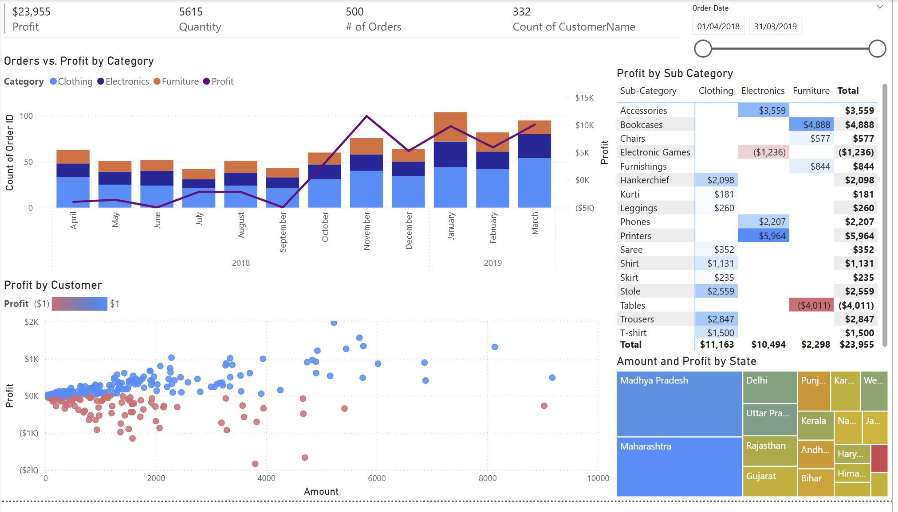
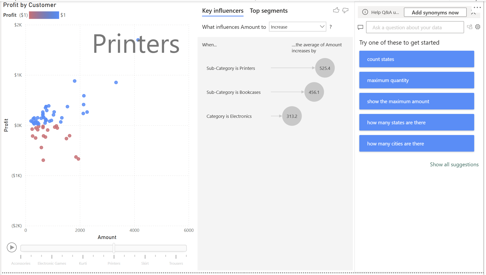

# E-Commerce Data Power BI Dashboard

## 项目描述

该项目基于 Kaggle 的 [Kaggle E-Commerce Dataset](https://www.kaggle.com/datasets/benroshan/ecommerce-data)，使用 Power BI 构建交互式仪表板，旨在分析销售情况、盈利能力、产品表现和客户分布等关键指标。

---

## 数据分析目标

### 目标

- 复盘现有产品线，找出可改进的方面

### 用户角色

- 财务负责人

### 用户操作

- 找出可以提升收入的方向  
- 找出表现不佳的产品和地区

### 使用频率

- 每月

---

## 核心指标（KPIs）

| KPI | 计算方式 | 数据来源 | 可视化方式 |
|----------|------|----------|-------------|
| Profit 利润 | 利润总额 | Order Details.csv | 趋势图、KPI  |
| Quantity 数量 | 业务各区域的出货量 | Order Details.csv | 多行卡片图 |
| Order Volume 订单量 | 仓库的订单发货量 | List of Orders.csv | KPI、折线图等 |

---

## 项目结构

1. **上传与转换数据**
   - 数据格式调整、数据合并、处理空行与重复项
2. **数据可视化**
   - Z字形布局
   - 多行卡片图
   - 利润趋势图
   - 各品类利润图（矩阵）
   - 客户盈利能力（散点图）
   - 各州利润图（树状图）
   - 添加切片器与交互筛选器
4. **深入分析**
   - 各品类利润散点图（带播放轴）
   - 关键影响因素图
   - 问答

---

## 分析总结

- 总体盈利能力直到 2019 年 10 月前一直为负。
- Electronic Games 和 Tables 两个品类盈利能力为负，应重点关注。
- 332 位客户中有 182 位客户盈利为负，占比约为 55%。
- 不盈利客户集中于：Madhya Pradesh、Maharashtra地区。
- Bookcases 和 Printers 是推动收入的关键产品子类。

---

## 改进建议

- 请门店经理评估最不盈利的客户。
- 分析盈利表现不佳的州，找出客户盈利能力差异大的原因。
- 暂停销售 Tables 和 Electronic Games，直到成本结构得到优化。
- 扩大盈利子类产品的销售，以维持持续的盈利趋势。

---

## 项目文件

- `Ecommerce_Dashboard.pbix`: Power BI 项目文件  
- `Order Details.csv`, `List of Orders.csv`: 原始数据文件  
- `Dashboard_Screenshots/`: 仪表板截图  

---

## 仪表板截图

  

